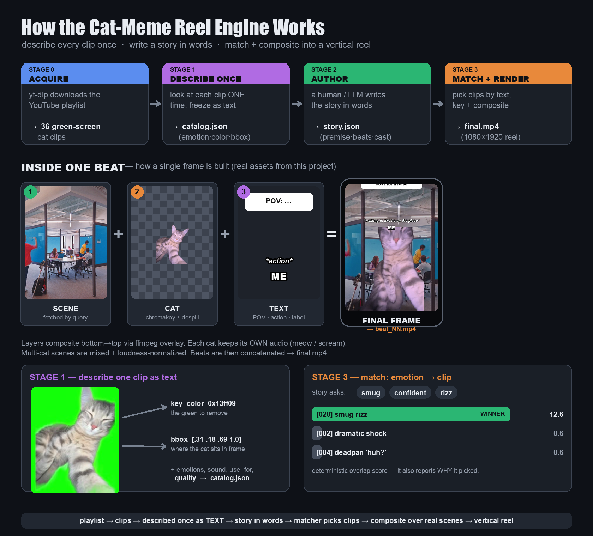

# 🐱 Cat-Meme Reel Engine

Turns a library of green-screen cat clips into narrated **POV story reels** (vertical,
1080×1920) in the style of cat-meme shorts. You describe each clip once; then you write a
story in plain words and desired emotions, and the engine matches clips, drops them onto
scene-relevant backgrounds, labels them, and renders the video.



## Quick start

```bash
# 1. (one time) describe every clip as text  ->  data/catalog.json
python3 engine/build_catalog.py

# 2. render a story  ->  output/final.mp4
python3 engine/render.py data/stories/functional-adult.json
```

See what a feeling resolves to: `python3 engine/match.py sleepy relaxed`.

## 🎬 Studio (web UI)

A visual front-end (Vite + [HeroUI](https://heroui.com/)) puts everything on
screen: a **gallery** of rendered reels, the searchable **clip library**, a
beat-by-beat **story** view that renders with a **live streaming log**, and an
interactive emotion→clip **matcher**.

```bash
pip install -r requirements.txt        # fastapi, uvicorn, pillow
cd web && npm install && npm run build  # one-time build of the UI
cd .. && python3 engine/server.py       # -> http://localhost:8000
```

The backend (`engine/server.py`) serves the UI, the REST API, and all media from
one port. See [`web/README.md`](web/README.md) for dev mode (hot reload).

## Layout

```
engine/        code (build_catalog · match · render · paths)
clips/         source green-screen clips        (git-ignored, re-downloadable)
backgrounds/   bundled AI scene library         (preferred over the web)
data/          catalog.json + stories/*.json    (committed)
work/          regenerable artifacts            (git-ignored)
output/        finished reels                   (git-ignored)
docs/          full documentation  ← start at docs/README.md
```

## How it works (1 sentence)

Playlist → clips → **described once as text** (`catalog.json`) → you write a story in
words → a matcher turns each desired emotion into a clip → ffmpeg keys the cats onto
scene backgrounds, grounds them, adds the POV bubble / labels / captions, and stitches
the beats into a reel.

**Full docs:** [`docs/`](docs/README.md) — architecture, the renderer's grounding math,
the background system, the design study behind the style, story-authoring guide, and the
decisions/gotchas.
